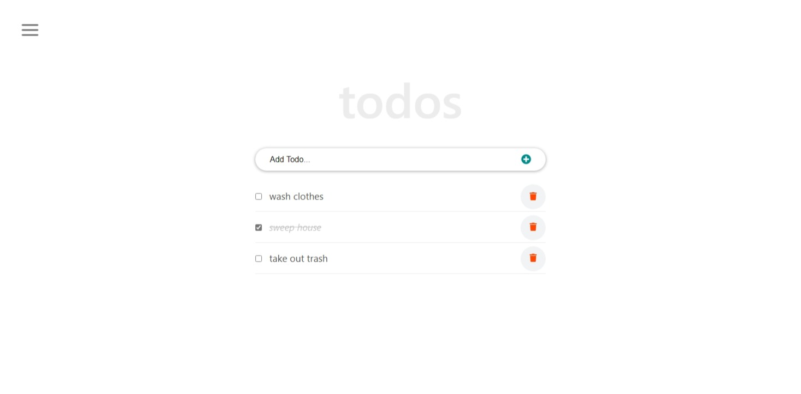
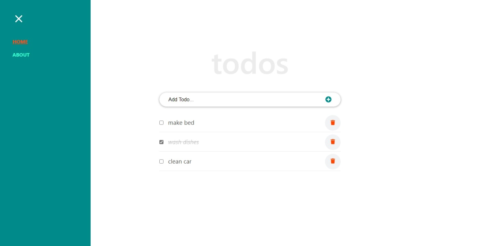

# To-do App
A To-do list app which utilises the power of React routers for Single page applications as well as React components for usable component and fast and efficient DOM manipulation using the React Virtual DOM

## Screenshots

## Built With
- React

## Prerequisites
 - [React](https://reactjs.org/docs/getting-started.html)
 -  [Git](https://git-scm.com/downloads)
 -  [Node](https://nodejs.org/en/download/)

## Installation

Go to your terminal, navigate to your working directory and run

`git clone https://github.com/chukwuemeka1234/react-todos-app`

After that navigate to the newly created folder

`cd react-todos-app`

You now have access to the files.
To install necessary dependencies run

`npm install`

Start a local server running the command

`npm start`

You should now have the project running locally on a dev server.

## Acknowledgements
This project was built from the tutorial [React Tutorial From Scratch: A Step-by-Step Guide (2021)](https://ibaslogic.com/react-tutorial-for-beginners/)

## Demo

Check out the [live version](https://unruffled-kowalevski-169996.netlify.app) of the website for more details.

## Author

👤 **Victor Chukwuemeka**

- GitHub: [@chukwuemeka1234](https://github.com/chukwuemeka1234)
- Twitter: [@avc_victor](https://twitter.com/@avc_victor)
- LinkedIn: [ani-chukwuemeka](https://linkedin.com/in/ani-chukwuemeka-a65421199/)

## 🤝 Contributing

Contributions, issues, and feature requests are welcome!

Feel free to check the [issues page](../../issues/).

## Show your support

Give a ⭐️ if you like this project!

## 📝 License

This project is [MIT](https://github.com/chukwuemeka1234/math-magicians/blob/develop/LICENSE) licensed.